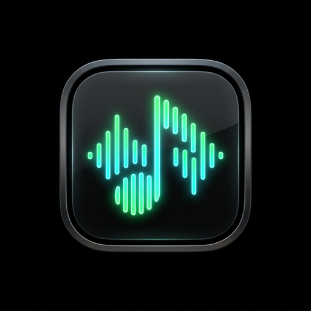
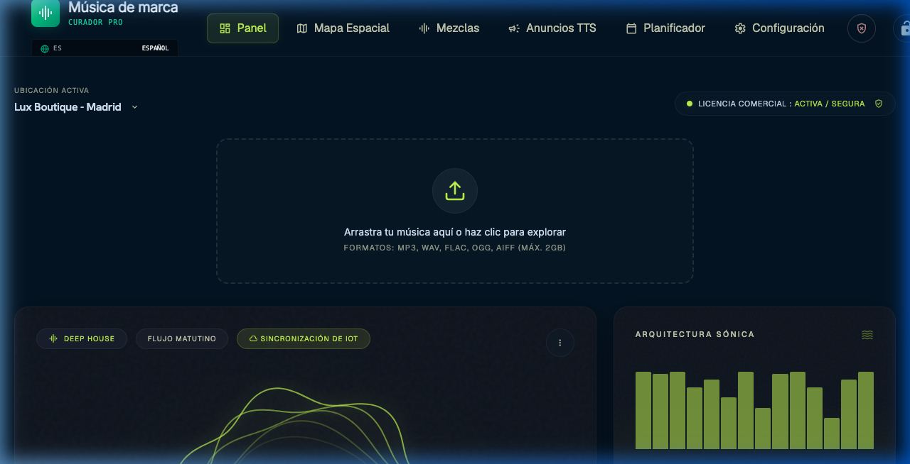

  

<h1 align="center">Brand Music Curator V1.0.0</h1>

  <b>B2B Audio Sensory Neuro-Architecture Platform & Background Music Player</b> 
  <i>Plataforma de Neuro-Arquitectura Sensorial de Audio y Reproductor de Hilo Musical B2B</i>

  
  
  
  

🌐 **Читать на:** [🇬🇧 English](README.md) | [🇪🇸 Español](README_es.md) | [🇩🇪 Deutsch](README_de.md) | **🇷🇺 Русский** | [🇯🇵 日本語](README_ja.md) | [🇺🇦 Українська](README_uk.md) | [🇨🇳 中文](README_zh.md)

---

## 🎯 Видение

Создание Brand Music Curator проистекает из глубокого разочарования в индустрии розничной торговли. Как инженеры, мы поняли, что аудио — это не украшение, а психологический якорь. Этот инструмент был разработан как окончательный цифровой аудиодвойник. Это не плеер, а кураторский мозг, который понимает энергетику помещения и защищает бизнес от проверок авторских прав.

> [!NOTE]
> Developed by **produktes-code** and **Jesús Ferrer (CHUS BZN)** to establish professional standards in commercial engineering.

---

## 📸 Interface / Ergonomics

---

## ⚙️ Мастер-класс параметров

- **Аналитический движок DSP**: Мы анализируем необработанные аудиобайты на энергию RMS, BPM и ключ для плавных переходов.
- **Матрица из 45 музыкальных стилей**: Создавайте индивидуальные звуковые текстуры, комбинируя проценты жанров.
- **Топология независимых зон**: Управляйте различными атмосферами с одной машины.
- **SGAE Shield**: Защита от штрафов за авторские права путем переключения на бесплатные каталоги.
- **Абсолютный резерв**: Прозрачное переключение на Spotify в случае локальных сбоев.

---

## 🛡️ Архитектура экранирования

Экранирование:

• Anti-Flood: Блокировка всплесков запросов.
• Magic Bytes: Гексадецимальная проверка файлов.
• 2 GB Limit: Защита оперативной памяти.

---

## 🚀 Техническое развертывание

Архитектура 'Zero-Friction' интегрирует DSP и Python непосредственно в приложение.

### 🍎 Пользователи macOS (Gatekeeper)
Gatekeeper заблокирует файл из-за отсутствия платного сертификата. Решение: **Правый клик -> Открыть**.

### 🪟 Пользователи Windows (SmartScreen)
Windows Defender может показать синее предупреждение. Нажмите **'Подробнее'**, а затем **'Выполнить в любом случае'**.

---

## 📚 Документация и руководства

Загрузите наше официальное руководство:

📥 **[USER_MANUAL.pdf (PDF - 7 Languages)](docs/USER_MANUAL.pdf)**

---

## ⚖️ Инженерный манифест

Разработано produktes-code и Jesus Ferrer (CHUS BZN). CC BY-NC-SA 4.0. CORPORATE STANDARD.

